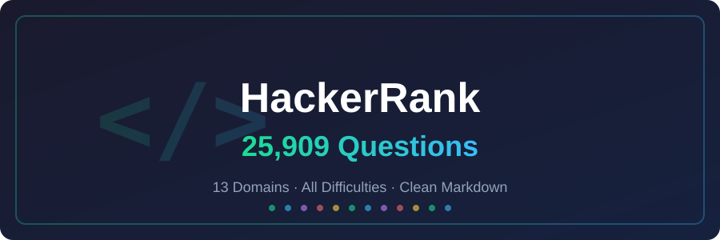

<div align="center">

# 

# **HackerRank Dumper**

[](https://github.com/mohit-wqsxb/hackerrank-dumper/stargazers)
[](https://github.com/mohit-wqsxb/hackerrank-dumper/network/members)
[](LICENSE)

---

**Every HackerRank coding question, fully scraped with problem statements, sample I/O, constraints, and explanations — in clean, searchable Markdown.**

[Features](#-features) · [Domains](#-domains) · [Quick Start](#-quick-start) · [Sample](#-sample-output) · [License](#-license)

---

</div>

## Overview

| Metric | Value |
|:-------|------:|
| Total Questions | **25,909** |
| Domains | **13** |
| File Format | Markdown (`.md`) |
| Total Size | **~60 MB** |
| Index Size | **12.7 MB** |

A complete offline archive of **25,909** HackerRank coding problems scraped across **13 domains** and **all difficulty levels**.

Every question includes:
- Full problem statement (with LaTeX math)
- Sample inputs & outputs
- Constraints and input format
- Explanations and editorial hints
- Metadata: difficulty, success ratio, tags, direct URL

---

## Features

| Feature | Description |
|:--------|:------------|
| **Complete Archive** | 25,909 questions across all 13 HackerRank domains |
| **Clean Markdown** | Every question is a standalone `.md` file |
| **Rich Content** | Problem statements, sample I/O, constraints, explanations |
| **LaTeX Preserved** | Math formulas render beautifully on GitHub |
| **Metadata Index** | `challenges.json` for programmatic access to all questions |
| **All Difficulties** | Easy, Medium, Hard, Expert — every level included |

---

## Domains

<table>
<tr>
<td width="50%">

| Domain | Questions | Description |
|:-------|----------:|:------------|
| Algorithms | 1,993 | Sorting, searching, DP, graphs, greedy |
| Data Structures | 1,993 | Trees, heaps, linked lists, hashmaps |
| Python | 1,993 | Python-specific challenges |
| Java | 1,993 | Java-specific challenges |
| C | 1,993 | C language challenges |
| C++ | 1,993 | C++ specific challenges |
| Mathematics | 1,993 | Number theory, combinatorics, geometry |

</td>
<td width="50%">

| Domain | Questions | Description |
|:-------|----------:|:------------|
| SQL | 1,993 | Query writing, joins, window functions |
| Databases | 1,993 | Database design, normalization |
| Shell | 1,993 | Bash scripting challenges |
| Regex | 1,993 | Regular expression patterns |
| FP | 1,993 | Functional programming (Haskell, Erlang) |
| AI | 1,993 | Machine learning, NLP, robotics |

</td>
</tr>
</table>

---

## Quick Start

```bash
# Clone the repo
git clone https://github.com/mohit-wqsxb/hackerrank-dumper.git
cd hackerrank-dumper

# Browse a question
cat output/questions/algorithms/solve-me-first.md
```

### Search across all questions

```bash
# Find all binary search problems
grep -rl "binary search" output/questions/ | head -20

# List all Hard problems
grep -l "Hard" output/questions/*/*.md

# Count questions per domain
for d in output/questions/*/; do echo "$(basename $d): $(ls "$d" | wc -l)"; done
```

### Query the JSON index

```python
import json

with open("output/challenges.json") as f:
    challenges = json.load(f)

# Find all Hard algorithms
hard_algos = [c for c in challenges if c["domain"] == "algorithms" and c["difficulty"] == "Hard"]
print(f"Found {len(hard_algos)} hard algorithm problems")
```

---

## Project Structure

```
hackerrank-dumper/
├── README.md
├── LICENSE
└── output/
    ├── challenges.json          # Master index (25,909 entries, 12.7 MB)
    ├── metadata/                # Per-domain metadata
    │   ├── algorithms.json
    │   ├── python.json
    │   └── ... (13 files)
    │
    └── questions/               # Full problem statements
        ├── algorithms/          # 1,993 .md files
        │   ├── solve-me-first.md
        │   └── ...
        ├── data-structures/
        ├── python/
        ├── java/
        ├── c/
        ├── cpp/
        ├── mathematics/
        ├── sql/
        ├── databases/
        ├── shell/
        ├── regex/
        ├── fp/
        └── ai/
```

---

## Sample Output

<details>
<summary><b>Solve Me First</b> — click to expand</summary>

```markdown
# Solve Me First

- **Domain:** algorithms
- **Difficulty:** Easy
- **Max Score:** 1
- **Success Ratio:** 0.9757
- **Total Submissions:** 5,078,218
- **Solved Count:** 4,954,820
- **URL:** https://www.hackerrank.com/challenges/solve-me-first

## Problem Statement

Complete the function $solveMeFirst$ to compute the sum of two integers.

**Example**
$a = 7$
$b = 3$

Return $10$.

## Constraints

- $1 \le a, b \le 1000$

## Sample Input

a = 2
b = 3

## Sample Output

5
```

</details>

---

## Use Cases

| Use Case | How |
|:---------|:----|
| **Interview Prep** | Browse offline, search by topic, no internet needed |
| **Build Question Bank** | Import `challenges.json` into your app |
| **AI Training** | Use problem statements + constraints as training data |
| **Custom Practice Sets** | Filter by difficulty, domain, or tags |
| **Offline Access** | Practice anywhere without WiFi |

---

## License

Distributed under the **MIT License**. See `LICENSE` for more information.

---

<div align="center">

**Built with ❤️ for the coding community**

[⬆ Back to Top](#hackerrank-dumper)

</div>
